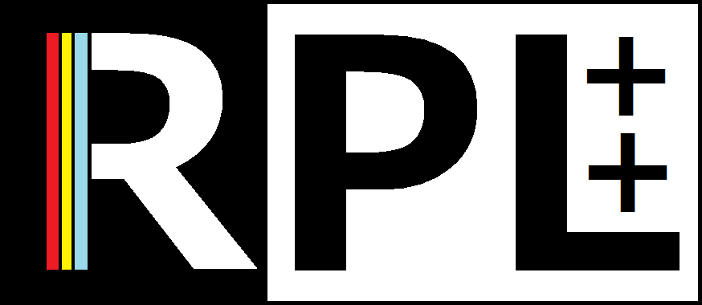

# RPL++

RPL++ - Stack-based Reverse polish notation Programming Language 
[Example programs](https://github.com/NishiOwO/rpl-examples)

## Quick Install
To quickly install an RPL build, install wget and run the following command:
`wget -q https://coredoes.dev/mirror/rpl/getrpl.sh -o getrpl.sh && chmod +x getrpl.sh && ./getrpl.sh && rm getrpl.sh`